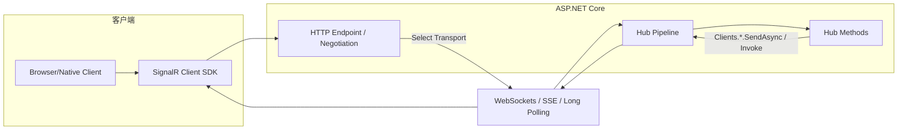
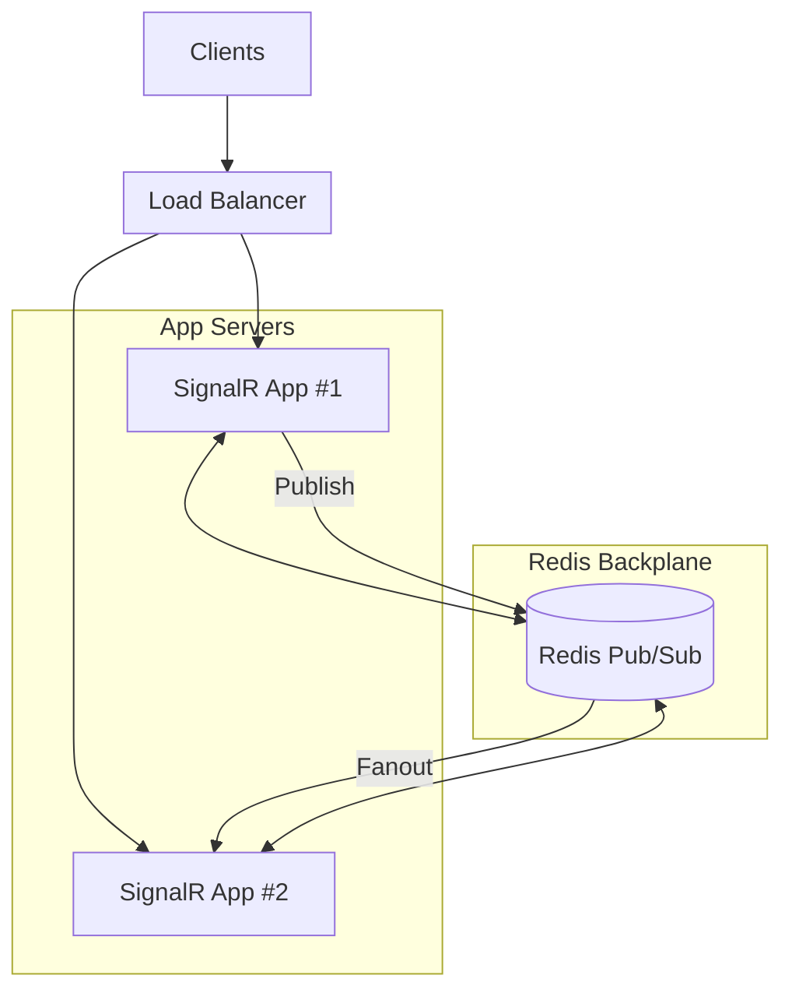
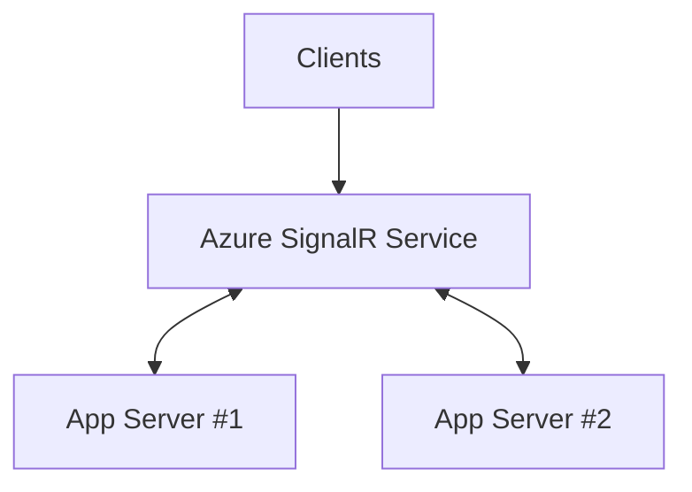

# 什么是 SignalR：从“实时 Web”到可规模化的双向推送（.NET 技术栈）

## 0. 导读
在传统 HTTP 请求/响应模型里，客户端发起请求，服务端返回响应；**服务端很难在“没有新请求”的情况下主动把更新推给客户端**。为了解决“实时”需求，工程上常见的办法包括：轮询、长轮询、Server-Sent Events（SSE）或 WebSocket。

**ASP.NET Core SignalR** 的定位是：一个开源库，用更高层的抽象（Hub、RPC、连接管理、分组、回退传输、扩缩容方案）来简化“实时 Web 功能”的实现，使得服务端代码可以“即时推送”内容到客户端。

---

## 1. 什么是 SignalR：从根源到现状，从现象到本质

### 1.1 从现象理解：你想要的是“实时”，你得到的是“推送 + 双向调用”
当业务说“实时”，通常背后至少包含以下一类需求：

- 高并发且高频的数据刷新（看板、监控、竞价、投票等）
- 通知（站内信、告警、状态变更）
- 协作（白板、会议协作、多人编辑）
- 聊天

SignalR 在官方文档中明确列出这类场景属于“适合使用 SignalR 的候选”。

### 1.2 从根源理解：实时通信的几条“物理规律”
实时通信之所以难，不是因为“发消息”难，而是因为以下约束：

- **连接必须长期存在**：否则就只能靠“不断发请求”（轮询）来“猜”有没有更新。
- **网络与浏览器环境差异**：代理、企业网关、老旧浏览器、移动网络切换等，会导致某些传输不可用。
- **分布式部署下的广播一致性**：多实例部署时，每台机器只知道自己维护的连接；如果你要给“所有客户端”广播，必须有跨实例的消息分发机制。

SignalR 的设计正是围绕这些约束把复杂度封装成可复用能力（Hub/传输回退/扩缩容方案等）。

### 1.3 SignalR 的本质：一个“面向实时场景的 RPC + 连接管理 + 广播模型”
SignalR 的本质可以总结为：

- **通信抽象**：用 Hub 作为高层管道，让客户端与服务端可以互相调用方法（跨机器边界的 dispatch 由 SignalR 处理）。
- **实时传输**：优先使用 WebSocket，必要时回退到 SSE/Long Polling。
- **连接与拓扑管理**：自动管理连接、分组、向所有连接或指定连接/组发消息。

### 1.4 SignalR 为什么不是“普通服务调用框架”？
SignalR 面向的是“在线连接上的实时交互”，而不是一般意义上的“服务到服务 RPC”。

---

## 2. SignalR 与其他服务调用/通信方式：本质差异是什么？

### 2.1 SignalR vs 传统 REST：请求驱动 vs 推送驱动
- REST/HTTP：典型交互以“客户端请求驱动”为主。
- SignalR：典型交互以“服务端推送驱动”为主（当然也支持客户端调用服务端方法）。

 SignalR 的核心价值在于让服务端能“即时推送”内容到客户端。

### 2.2 SignalR vs 轮询：资源浪费 vs 事件驱动
轮询/长轮询属于“用请求模拟实时”的方式：客户端为了拿到更新不得不持续发起请求，即使大多数时候没有变化也会产生额外负载，并且更新有天然的时间粒度（取决于轮询间隔）。

SignalR（以及 SSE/WebSocket 这类推送模型）从交互模型上减少了“为了实时而不断请求”的无效开销：只有在有消息/状态变化时才发送。

### 2.3 SignalR vs WebSocket（原生）：协议能力 vs 工程能力
WebSocket 提供双向、持久的通信通道，适用于聊天、看板、游戏等需要快速实时通信的场景。

而 SignalR 属于“在 WebSocket 之上”的工程抽象层：连接管理、RPC 模型、分组广播、传输回退、扩缩容等。

### 2.4 SignalR vs SSE（EventSource）：双向 vs 单向
SSE（EventSource）常用于“服务器向浏览器单向推送”的场景。

SSE 的典型特点：

- **服务器 -> 客户端单向流式推送**（浏览器端通过 `EventSource` 接收）。
- 客户端如果要“发数据给服务端”，通常还需要额外的 HTTP 请求通道。

SignalR 则明确提供“客户端与服务端互相调用方法”的 Hub 模型。

### 2.5 SignalR vs gRPC streaming：浏览器生态与协议栈差异
SignalR 面向的主要是浏览器与多种客户端 SDK 的“实时交互”。而 gRPC streaming 更偏向“强契约 RPC + 流式数据”，两者在协议栈与生态侧重点上不同。

### 2.6 多维度对比表（工程选型视角）

| 维度 | SignalR | 原生 WebSocket | SSE (EventSource) | 轮询/长轮询 | gRPC streaming |
|---|---|---|---|---|---|
| 目标场景 | Web 实时交互 + 广播 + 分组 + RPC 模型 | 双向字节流通道 | 服务器推送到浏览器（单向） | “模拟实时” | 服务间/多语言 RPC，支持 streaming |
| 传输 | WebSockets/SSE/Long Polling 自动选择与回退 | WebSocket（RFC6455） | HTTP + text/event-stream | HTTP | HTTP/2（硬性要求） |
| 抽象层级 | Hub（双向方法调用）、连接/组 | 低层通信通道 | EventSource 事件流 | 请求/响应 | IDL+stub+streaming |
| 典型收益 | 工程能力强、上手快、适配复杂网络 | 最灵活、最可控 | 简单、浏览器原生支持 | 最简单 | 性能强、强契约 |
| 典型代价 | 需要理解连接/扩缩容/粘性会话等 | 需要自建连接管理与协议 | 单向，回传需额外通道 | 资源浪费、数据滞后 | 浏览器直连受限、协议栈要求高 |

---

## 3. SignalR 的实现方案：从 Hub 到传输，到扩缩容

### 3.1 核心组件与数据流
从 Microsoft Learn 的描述抽象出最关键的组件：

- **Hub**：高层管道，允许客户端与服务端互相调用方法；SignalR 负责跨机器边界的 dispatch。
- **Hub Protocol**：SignalR 内置 JSON（文本）与 MessagePack（二进制）协议。
- **Transports**：WebSockets / Server-Sent Events / Long Polling。

结构图（单实例）：



### 3.2 传输选择与回退（Transport Fallback）
SignalR 支持的传输（按“优雅降级”顺序）：

- WebSockets
- Server-Sent Events
- Long Polling

并且会在服务端与客户端能力范围内自动选择最佳传输。

### 3.3 Hub：双向“方法调用”抽象
Hub 是 SignalR 的核心抽象：

- 客户端调用服务端方法
- 服务端调用客户端方法（通过向客户端发送包含“方法名+参数”的消息）
- 支持强类型参数并启用模型绑定（文档描述）

### 3.4 连接管理、分组与广播
SignalR 文档在特性列表中明确提到：

- 自动处理连接管理
- 可向所有连接同时发送消息
- 可向特定连接/组发送消息

### 3.5 规模化部署：为什么需要 Backplane（或托管服务）
SignalR 扩缩容文档指出：

- 在多实例（server farm）中，SignalR 需要让同一个连接的所有 HTTP 请求由同一进程处理（sticky sessions）。
- 规模化问题的本质是：每台服务器只知道自己维护的连接，广播只会发到本机连接。
- 解决方案包括 Azure SignalR Service 和 Redis backplane。

结构图（多实例 + Redis backplane）：



- Redis backplane 通过 Redis 的 pub/sub 转发消息到其他服务器。

结构图（Azure SignalR Service）：



SignalR 扩缩容文档明确指出：

- Azure SignalR Service 作为实时流量代理（proxy），并在多服务器下起到 backplane 的作用；客户端会被重定向到服务。
- 并且推荐：**在 Azure 上托管的 ASP.NET Core SignalR 应用，推荐使用 Azure SignalR Service**。

---

## 4. .NET 技术栈下类似/替代 SignalR 的方案有哪些？

### 4.1 典型候选与定位
这里的“类似/替代”指的是：在 .NET 场景中，用于实现“实时推送/双向通信/广播”的技术选项。

- **原生 WebSocket（ASP.NET Core WebSockets）**：最低层通信通道。
- **SSE（EventSource）**：浏览器原生的服务器推送机制（单向）。
- **gRPC streaming（.NET）**：强契约的流式 RPC（需要 HTTP/2）。
- **Azure SignalR Service**：SignalR 的托管扩缩容/代理方案。
- **Azure Web PubSub**：Azure 托管实时消息服务，面向实时与 pub/sub 模式。

### 4.2 Azure Web PubSub：更偏“托管实时 + Pub/Sub 模式”的服务
Azure Web PubSub 文档强调：它让构建“服务端与客户端需要实时交换数据”的应用更容易，并指出小规模时常用轮询实现实时，但轮询有 outdated/inconsistent data 与资源浪费等缺点。

同时文档在“Benefits”中描述其面向大规模连接与高可用架构的能力（如单资源可扩展到大量并发连接、支持多区域等）。

### 4.3 多维度对比表（.NET 选型）

| 方案 | 是否双向 | 工程抽象 | 扩缩容 | 浏览器适配 | 集成方式（典型） | 主要优点 | 主要限制 |
|---|---:|---|---|---|---|---|---|
| ASP.NET Core SignalR | 是 | Hub + RPC + 连接/组 + 回退传输 | 可配 Redis backplane；Azure 上推荐 Azure SignalR Service | 好（自动选择传输） | `AddSignalR()` + `MapHub()` | 上手快、工程能力完整 | 多实例需考虑 sticky sessions / backplane |
| 原生 WebSockets（ASP.NET Core） | 是 | 低层通道 | 自己做 | 取决于环境 | `UseWebSockets()` + 手写协议 | 最灵活可控 | 连接/重连/广播/鉴权等需自建 |
| SSE (EventSource) | 否（服务端→客户端） | 事件流 | 自己做 | 浏览器原生 | 服务端返回 `text/event-stream` | 简单、适合单向推送 | 回传需额外通道 |
| gRPC streaming | 是 | 强契约 RPC | 自己做（或基于平台能力） | 浏览器直连受限 | `.proto` + gRPC server/client | 性能与类型系统强 | requires HTTP/2，浏览器生态限制 |
| Azure SignalR Service | 是 | SignalR 托管化 | 服务管理连接与 backplane | 好 | `AddSignalR().AddAzureSignalR()` | 降低扩缩容与连接压力 | 依赖 Azure 资源 |
| Azure Web PubSub | 是（服务与客户端实时交换） | 托管实时 + pub/sub + REST API | 面向大规模连接 | 依赖 WebSocket（服务支持标准 WebSocket） | SDK/REST API/Functions 集成 | 大规模连接、托管能力强 | 引入云服务依赖 |

---

## 5. 选择 ASP.NET Core SignalR 做代码示例（官方推荐路径）

> 选择理由：SignalR 官方定位就是“简化实时 Web 功能”；并提供 Hub（双向方法调用）、连接/组、传输回退等能力。
>
> 示例与集成方式以 Microsoft Learn 的 ASP.NET Core SignalR 官方文档与教程为准。

### 5.1 服务端：定义 Hub（最小可用的广播示例）
Microsoft Learn 的入门教程给出典型 Hub 写法：继承 `Hub`，在 Hub 方法里通过 `Clients.All.SendAsync(...)` 调用所有客户端的某个方法名（如 `ReceiveMessage`）。

最小 Hub 示例（纯 C#）：

```csharp
using Microsoft.AspNetCore.SignalR;

public sealed class ChatHub : Hub
{
    public Task SendMessage(string user, string message)
    {
        return Clients.All.SendAsync("ReceiveMessage", user, message);
    }
}
```

### 5.2 服务端：注册与路由（AddSignalR + MapHub）
同一教程给出在 `Program.cs` 中配置 SignalR：

- `builder.Services.AddSignalR();`
- `app.MapHub<ChatHub>("/chatHub");`

并明确指出：该代码把 SignalR 加入到 ASP.NET Core 的依赖注入与路由系统。

最小 `Program.cs`（可运行）：

```csharp
var builder = WebApplication.CreateBuilder(args);

builder.Services.AddSignalR();

var app = builder.Build();

app.MapHub<ChatHub>("/chatHub");

app.Run();
```

### 5.3 客户端：.NET 控制台（最小可运行）
下面示例演示：

- 连接 Hub
- 订阅服务端广播的 `ReceiveMessage`
- 调用服务端 Hub 方法 `SendMessage`

```csharp
using Microsoft.AspNetCore.SignalR.Client;

var hubUrl = new UriBuilder
{
    Scheme = Uri.UriSchemeHttp,
    Host = "localhost",
    Port = 5000,
    Path = "/chatHub"
}.Uri;

var connection = new HubConnectionBuilder()
    .WithUrl(hubUrl)
    .WithAutomaticReconnect()
    .Build();

connection.On<string, string>("ReceiveMessage", (user, message) =>
{
    Console.WriteLine($"{user}: {message}");
});

await connection.StartAsync();

await connection.InvokeAsync("SendMessage", "client", "hello");

Console.WriteLine("Press Enter to exit...");
Console.ReadLine();

await connection.DisposeAsync();
```

### 5.4 上云：Azure SignalR Service（推荐在 Azure 上使用）
SignalR 扩缩容文档推荐 Azure 上使用 Azure SignalR Service；Azure SignalR Service 文档也给出典型集成方式：

- 安装 `Microsoft.Azure.SignalR`
- 在 `AddSignalR()` 后追加 `.AddAzureSignalR()`

---

## 参考资料

1. Microsoft Learn - Overview of ASP.NET Core SignalR
   - https://learn.microsoft.com/en-us/aspnet/core/signalr/introduction?view=aspnetcore-10.0

2. Microsoft Learn - Tutorial: Get started with ASP.NET Core SignalR
   - https://learn.microsoft.com/en-us/aspnet/core/tutorials/signalr?view=aspnetcore-10.0

3. Microsoft Learn - ASP.NET Core SignalR hosting and scaling
   - https://learn.microsoft.com/en-us/aspnet/core/signalr/scale?view=aspnetcore-10.0

4. Microsoft Learn - Use Azure SignalR Service
   - https://learn.microsoft.com/en-us/azure/azure-signalr/signalr-howto-use

5. Microsoft Learn - WebSockets support in ASP.NET Core
   - https://learn.microsoft.com/en-us/aspnet/core/fundamentals/websockets?view=aspnetcore-10.0
