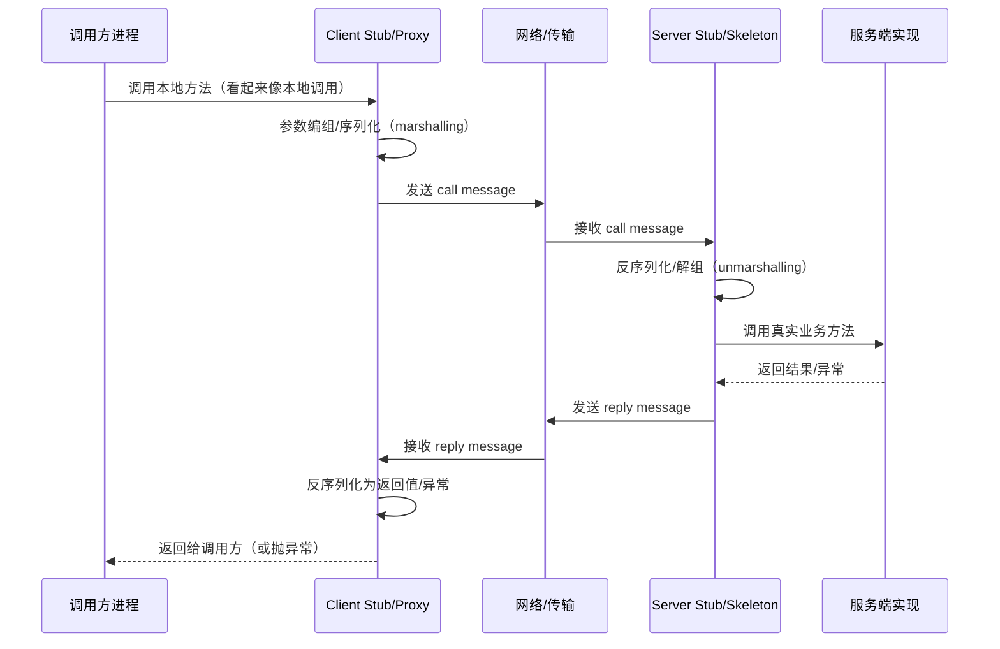
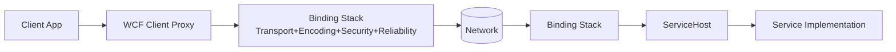
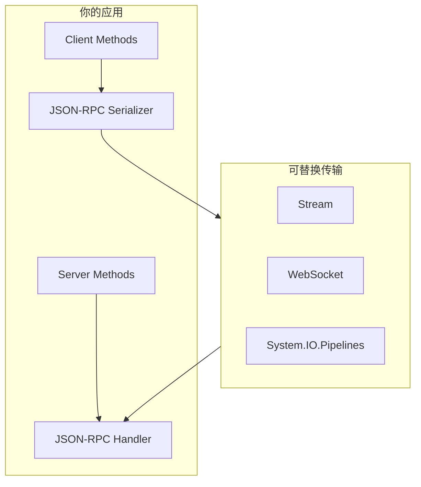

# 什么是 RPC：从"像本地调用一样"到 gRPC/WCF 的工程实践（.NET 技术栈）

## 0. 导读
RPC（Remote Procedure Call，远程过程调用）是分布式系统里最经典的一类服务调用抽象：**让你用"调用函数/方法"的方式去触发远端服务执行，并拿到返回结果**。

gRPC 官方介绍把它描述为：客户端可以像调用本地对象一样调用不同机器上的服务方法，从而更容易构建分布式应用与服务，并且基于"定义服务接口（方法、参数、返回值）"这一 RPC 思路来实现（同时也强调客户端 stub/服务端实现的概念）。

---

## 1. 什么是 RPC：从根源到现状，从现象到本质

### 1.1 从"过程调用（Procedure Call）"开始：本地调用的关键体验
在同一进程内调用一个函数，开发者天然得到以下体验：

- 调用方把参数"放到约定的位置"（栈/寄存器/对象等）
- 控制流转移到被调用者
- 被调用者执行完成后返回
- 调用方从约定位置取回返回值并继续执行

**RPC 的设计目标**就是把上面这套"本地调用体验"扩展到跨进程/跨机器的场景。

### 1.2 RPC 的模型（权威定义）：请求-响应（call/reply）+ 阻塞等待
IETF 的 ONC RPC（RFC 5531）把 RPC 模型描述得非常清楚：

- 控制流在逻辑上"穿过"两个进程：调用方进程与服务端进程
- 调用方发送 `call message` 并等待（block）`reply message`
- `call message` 携带参数，`reply message` 携带结果

用序列图表达这个模型：



> 注意：RFC 5531 也明确指出这是"示例模型"，协议本身不限制并发模型（服务端可多线程/异步等）。

### 1.3 现象 vs 本质：RPC 到底"帮你屏蔽"了什么？
很多同学理解 RPC 只停留在"像调用本地方法一样调用远端服务"。从工程角度看，RPC 屏蔽的是**一整套分布式调用链路**：

- **接口契约（Contract/IDL）**：描述可调用的方法、参数、返回值。
  - gRPC 明确采用 contract-first，并默认用 protobuf 的 `.proto` 作为 IDL。

- **代理/桩代码生成（Stub/Proxy Generation）**：把"远端方法"映射为本地可调用的方法。
  - gRPC 在 .NET 里会为服务端生成抽象基类，为客户端生成具体 client 类型。

- **参数编组与序列化（Marshalling/Serialization）**：把语言内对象变成可传输字节。
  - gRPC 在 Microsoft Learn 文档里明确提到 protobuf 的二进制序列化可减少网络使用。

- **传输与连接管理（Transport/Channel）**：连接复用、超时、消息大小限制等。
  - .NET gRPC client 以 `GrpcChannel` 表示到服务的长连接（long-lived connection）。

- **错误传播（Error Propagation）**：远端抛出的异常/错误如何映射到调用方。
  - Orleans 文档说明：当 grain 方法抛异常，Orleans 会跨 host 传播异常（并要求异常可序列化）。

### 1.4 一句话总结：RPC 的本质
**RPC 的本质**：

- **用"过程/方法调用语义"封装"跨网络的请求-响应交互"**（RFC 5531 的 call/reply 模型）。
- **用契约/桩代码/序列化/传输抽象**把分布式细节尽量隐藏，让调用方以更贴近编程语言的方式使用远端能力。

---

## 2. RPC 与其他服务调用方式：有没有本质差别？

这里给出一个务实结论：

- **从"网络交互"角度**：无论 RPC、REST、消息队列，本质都是跨进程通信。
- **从"抽象与约束"角度**：RPC 与 REST/消息的关键差异在于它们对"接口形态、交互风格、耦合方式"的约束不同。

### 2.1 RPC vs REST：统一接口 vs 特定接口
Fielding 在 REST 论文中指出：REST 与其他网络风格的核心区别在于强调"统一接口（Uniform Interface）"。统一接口能简化整体架构并提升可见性/可演进性，但代价是效率下降，因为信息以标准化形式传输，而不是针对应用的特定形式。

因此：

- **RPC 更偏向"特定接口（specific interface）"**：方法名、参数、返回值都强绑定到服务能力。
- **REST 更偏向"统一接口 + 资源表述"**：用统一语义（如 HTTP 方法）对资源进行操作，强调整体可演进与通用性。

### 2.2 RPC vs 异步消息（Message Broker / Queue）：同步耦合 vs 时间解耦
Azure Architecture Center 指出，消息代理（message broker）能够在"生成消息的生产者"和"使用消息的消费者"之间解耦，并提供**时间解耦（temporal decoupling）**：生产者与消费者不必同时在线；生产者不必等待消费者完成长耗时操作；通过消息实现异步处理。

因此：

- **RPC 更像"我现在要你立刻执行并给我结果"**（同步请求-响应的调用语义很强）。
- **消息更像"我发出一个命令/事件，什么时候处理由系统决定"**（异步、缓冲、削峰、解耦）。

### 2.3 RPC vs 事件驱动/发布订阅：点对点调用 vs 广播语义
在事件驱动里：

- 生产者往往不关心具体哪个消费者处理，也不一定期待"同步返回值"。
- 典型目标是解耦与可扩展（多消费者、可重放、最终一致）。

这类交互从抽象上就与 RFC 5531 描述的 call/reply（调用方等待回复）不同。

### 2.4 多维度对比表

| 维度 | RPC（典型） | REST（典型） | 异步消息（典型） |
|---|---|---|---|
| 抽象 | 方法/过程调用 | 资源 + 表述 + 统一接口 | 消息/命令/事件 |
| 交互形态 | call/reply（常见为同步等待） | 请求/响应（语义统一、可缓存） | 生产-消费（时间解耦） |
| 接口约束 | 强契约（方法签名） | 统一接口约束（Fielding） | 消息契约（事件 schema） |
| 耦合 | 客户端对服务接口耦合较强 | 对资源模型/统一语义耦合 | 生产者与消费者通过 broker 解耦 |
| 典型收益 | 开发体验贴近代码、性能可控 | 可见性/通用性/可缓存/可演进 | 缓冲削峰、解耦、异步处理 |
| 典型代价 | 版本演进、错误语义、超时重试等复杂 | 统一接口可能牺牲效率（Fielding） | 需要幂等/补偿/最终一致等工程能力 |

---

## 3. .NET 技术栈下的 RPC 实现方式有哪些（含结构图）

### 3.1 gRPC on ASP.NET Core：现代 .NET 的主流 RPC 路线
Microsoft Learn 对 gRPC 的定位是：高性能、轻量、契约优先、默认 protobuf、支持多种 streaming，并可用于高效率微服务、跨语言系统、实时点对点服务。

同时，ASP.NET Core gRPC 文档明确：**gRPC requires HTTP/2**，并给出了 Kestrel 上 HTTP/2 + TLS 的建议配置。

结构图（逻辑视角）：

```mermaid
flowchart LR
  A[.NET Client App] --> B[Generated gRPC Client (Stub)]
  B --> C[GrpcChannel (long-lived connection)]
  C --> D[HTTP/2 + TLS]
  D --> E[Kestrel + ASP.NET Core]
  E --> F[Generated Service Base (Skeleton)]
  F --> G[Your Service Implementation]
```

### 3.2 WCF（.NET Framework）：经典企业级 RPC/服务框架（SOAP）
WCF 的核心卖点是"可配置的通信栈"：通过 bindings/behaviors/services 等配置决定传输（HTTP/TCP/命名管道等）、安全、可靠性等。

WCF 的两个典型 binding 示例：

- `basicHttpBinding`：使用 HTTP 发送 SOAP 1.1 消息、强调与 WS-I BP 1.1/ASMX 等互操作；默认文本编码；安全默认关闭。
- `netTcpBinding`：默认传输安全 + TCP + 二进制编码；面向内网 WCF 通信；默认配置相比 `wsHttpBinding` 更快，并通过配置选择性开启能力（例如可靠消息）。

结构图（典型代理+binding 栈视角）：



### 3.3 CoreWCF：把 WCF 服务端带到现代 .NET（迁移路径）
Microsoft Learn 提供了把 .NET Framework 上的 WCF Server-side 项目升级到 CoreWCF（.NET 6）的迁移指导，并指出该工具使用 CoreWCF 来完成自托管 WCF 服务端的迁移。

CoreWCF 官网也明确给出定位：CoreWCF 是一个基于 WCF 的 .NET Core Web Services 框架。

### 3.4 WCF 客户端在现代 .NET 的现实：依赖 NuGet 包 + 目标框架约束
Microsoft Learn 明确说明：WCF Client 6.0 目标为 .NET 6 且不再支持 .NET Standard 2.0；并给出建议（例如多目标框架、移除部分已废弃包）。

生成客户端代理方面，Microsoft Learn 描述 `dotnet-svcutil` 可从 WSDL 或网络服务元数据生成 WCF 客户端代理方法，并且是跨平台工具。

### 3.5 JSON-RPC（StreamJsonRpc）：轻量 RPC 协议 + 可自选传输
JSON-RPC 2.0 规范明确：JSON-RPC 是一种无状态、轻量的 RPC 协议，并且"传输无关"（transport agnostic），可用于进程内、socket、HTTP 等多种消息环境。

在 .NET 生态里，StreamJsonRpc 在 NuGet 的描述中明确：它实现了 JSON-RPC 线协议，并可运行在 Stream/WebSocket/System.IO.Pipelines 之上，独立于底层传输。

结构图（协议与传输分层视角）：



### 3.6 Orleans：以"代理对象（grain reference）"方式做分布式方法调用（RPC-like）
Orleans 文档说明：grain reference 是一个实现相同 grain interface 的代理对象，你用它来调用目标 grain；它代表逻辑身份、与物理位置无关。

Orleans 同时强调其编程模型基于异步编程（async/await），并描述调用方式与异常传播。

---

## 4. .NET 技术栈主流 RPC 方案对比（优缺点 / 集成 / 场景）

> 说明：这里的"主流"以 .NET 工程实践中常见方案为主，且每个条目的关键特性都对应官方/规范/权威来源。

| 方案 | 契约/接口 | 传输与协议 | Streaming | 主要优势 | 主要局限 | 适用场景 | 典型集成方式 |
|---|---|---|---|---|---|---|---|
| gRPC on ASP.NET Core | `.proto`（contract-first，默认 protobuf） | gRPC over HTTP/2；服务端建议 TLS | 支持 client/server/双向 streaming | 高性能、轻量、强类型代码生成、适合微服务/跨语言/实时点对点 | 浏览器直连受限（常需 gRPC-Web）；HTTP/2/TLS/代理环境需要配置 | 内网微服务、跨语言系统、实时流式接口 | ASP.NET Core 托管 gRPC；客户端用 `Grpc.Net.Client` 或 `Grpc.Net.ClientFactory` |
| WCF（.NET Framework） | .NET Contract（接口/属性）+ 元数据（WSDL） | 多种 binding（HTTP/TCP 等）、SOAP；可配置安全/可靠等 | 取决于 binding/模式 | 传统企业集成成熟、互操作（如 `basicHttpBinding`） | 服务端主要在 .NET Framework；现代 .NET 侧需要迁移或选替代 | 传统 SOA、对 SOAP/WS-* 依赖、与 ASMX/旧系统互通 | `svcutil`/配置驱动 binding；服务端 `ServiceHost` |
| CoreWCF | WCF 风格 | 基于 WCF 概念迁移到 .NET 6+ | 取决于实现 | 迁移 WCF 服务端到现代 .NET 的路径 | 生态/能力与 WCF 完整度受限于项目现状；需要评估兼容面 | WCF 服务端现代化、逐步迁移 | 参考 Microsoft 升级指导与 CoreWCF 文档 |
| JSON-RPC（协议）+ StreamJsonRpc（.NET 库） | JSON-RPC 方法名+参数（规范定义数据结构与规则） | 传输无关（transport agnostic）；StreamJsonRpc 支持 Stream/WebSocket/Pipelines | 取决于上层设计；可做通知/请求 | 协议简单、实现轻量、对传输选择自由 | 标准化治理能力（鉴权、IDL、版本）需自行设计 | IDE/工具集成、进程间通信、轻量服务调用 | 直接引用 StreamJsonRpc；自定义传输（Stream/WebSocket 等） |
| Orleans（RPC-like） | Grain interface | Orleans runtime 负责路由与调用 | 以异步为主；可组合 Task 模式 | 代理对象/位置透明、天然分布式对象模型、异步编程模型明确 | 属于分布式运行时体系，不是"纯协议"；引入平台依赖 | 分布式业务域建模、状态ful actor、复杂并发/隔离需求 | 使用 Orleans SDK；通过 grain reference 调用 |

---

## 5. 选择 gRPC（.NET）进行代码示例讲解

> 选择理由：Microsoft Learn 在 gRPC 概览里强调其高性能、轻量、契约优先、默认 protobuf、支持多种 streaming，且适配现代 .NET/微服务场景。

### 5.1 定义契约（`.proto`）：先把"远端可调用的方法签名"写清楚
Microsoft Learn 明确：gRPC 使用 contract-first，默认使用 protobuf（`.proto`）作为 IDL；`.proto` 中包含服务定义与消息定义。

示例 `greet.proto`（与 Microsoft 文档示例结构一致）：

```proto
syntax = "proto3";
option csharp_namespace = "GrpcGreeter";
package greet;

service Greeter {
  rpc SayHello (HelloRequest) returns (HelloReply);
}

message HelloRequest {
  string name = 1;
}

message HelloReply {
  string message = 1;
}
```

### 5.2 生成服务端骨架（Service Base）并实现业务逻辑
Microsoft Learn 描述：服务端会生成抽象 service base，开发者通过继承并重写方法实现业务逻辑。

示例（最小可理解版）：

```csharp
public class GreeterService : Greeter.GreeterBase
{
    public override Task<HelloReply> SayHello(HelloRequest request, ServerCallContext context)
        => Task.FromResult(new HelloReply { Message = "Hello " + request.Name });
}
```

### 5.3 在 ASP.NET Core 托管 gRPC：注意 HTTP/2 与 TLS
Microsoft Learn 明确：gRPC requires HTTP/2，并建议 Kestrel 上的 gRPC endpoint 使用 TLS，并给出生产环境显式配置 TLS 的方式。

概念性 `Program.cs`（示意如何注册与映射服务）：

```csharp
var builder = WebApplication.CreateBuilder(args);

builder.Services.AddGrpc();

var app = builder.Build();

app.MapGrpcService<GreeterService>();

app.Run();
```

### 5.4 客户端调用：Channel（长连接）+ 强类型 Client
Microsoft Learn 指出：gRPC client 从 channel 创建；channel 表示到 gRPC 服务的 long-lived connection；并展示了 `GrpcChannel.ForAddress` 的典型用法。

示例：

```csharp
using var channel = GrpcChannel.ForAddress("https://localhost:5001");
var client = new Greeter.GreeterClient(channel);

var reply = await client.SayHelloAsync(new HelloRequest { Name = "World" });
Console.WriteLine(reply.Message);
```

### 5.5 更推荐的客户端集成：`HttpClientFactory`（gRPC client factory）
Microsoft Learn 给出：gRPC 与 `HttpClientFactory` 集成提供集中配置、管理底层 handler 生命周期、并在 ASP.NET Core gRPC 服务中自动传播 deadline 与 cancellation。

示例（在 `Program.cs` 注册 typed client）：

```csharp
builder.Services.AddGrpcClient<Greeter.GreeterClient>(o =>
{
    o.Address = new Uri("https://localhost:5001");
});
```

### 5.6 典型"踩坑点"与最佳实践（只列官方明确指出的部分）

- **HTTP/2 是硬性前提**：文档明确 "gRPC requires HTTP/2"。
- **避免在异步代码里使用阻塞方法**：Microsoft Learn 在 unary call 部分明确提示：阻塞方法不要在异步代码中使用，否则会导致性能与可靠性问题。

---

## 6. 选型建议：什么时候优先考虑 RPC？

你可以把 RPC 的适用场景理解为：

- **你需要强类型、强契约、低开销、高频调用**（例如内部微服务间调用）
- **你需要"像代码一样"的调用体验**，并希望通过代码生成降低接口联调成本
- **你明确接受同步 call/reply 带来的耦合**，并能在工程上处理超时、重试、限流、熔断等问题

反之，如果你的核心诉求是时间解耦、削峰填谷、异步处理、跨团队松耦合，Azure Architecture Center 对 message broker 的解耦与 temporal decoupling 描述更符合这类需求。

---

## 参考资料

1. RFC 5531: RPC: Remote Procedure Call Protocol Specification Version 2
   - https://www.rfc-editor.org/rfc/rfc5531

2. Microsoft Learn - Overview for gRPC on .NET
   - https://learn.microsoft.com/en-us/aspnet/core/grpc/?view=aspnetcore-10.0

3. Microsoft Learn - gRPC services with ASP.NET Core
   - https://learn.microsoft.com/en-us/aspnet/core/grpc/aspnetcore?view=aspnetcore-9.0

4. Microsoft Learn - gRPC services with C#
   - https://learn.microsoft.com/en-us/aspnet/core/grpc/basics?view=aspnetcore-10.0

5. Microsoft Learn - Call gRPC services with .NET client
   - https://learn.microsoft.com/en-us/aspnet/core/grpc/client?view=aspnetcore-10.0
